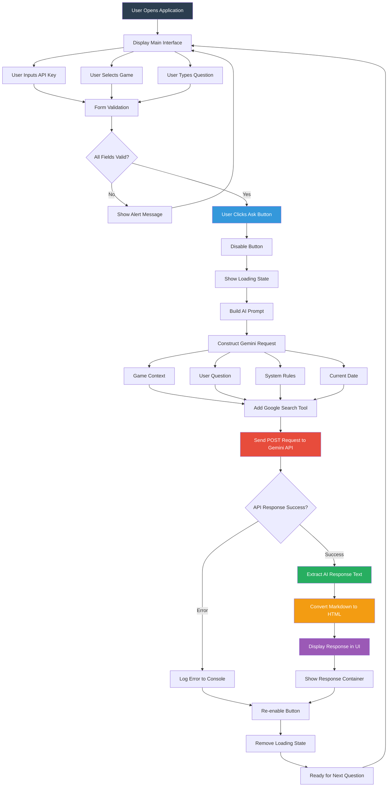

# Game Meta Assistant

An AI-powered web application that provides expert strategies, tips, and guidance for classic Super Nintendo and SEGA games. Built with Google Gemini API integration to deliver intelligent, context-aware responses about game mechanics, strategies, and builds.

## Description

The Game Meta Assistant is an interactive web application designed to help gamers improve their skills and understanding of classic retro games. By leveraging Google's Gemini AI model with integrated search capabilities, the application acts as a knowledgeable gaming companion that can answer questions about strategies, character builds, level walkthroughs, and advanced techniques for iconic games like Super Mario, Donkey Kong, and Sonic.

The application features a interface where users can select their game of interest, input their API key, and ask specific questions. The AI processes these queries with game-specific context and returns concise, actionable advice formatted in Markdown for easy readability. The system is designed to provide accurate, up-to-date information by utilizing Google Search integration, ensuring responses reflect current game knowledge and community strategies.

## Live Demo

https://luizaugustoliveira.github.io/assistente-de-meta/


## Main Application Flow



## Features

- Ask questions about strategies, builds, and tips for games like Mario, Donkey Kong, and Sonic
- AI-generated responses powered by Google Gemini 2.5 Flash
- Responsive and intuitive user interface
- Automatic conversion of Markdown responses to HTML
- Form validation with visual feedback
- Loading states for better user experience
- Google Search integration for up-to-date game information
- Context-aware responses specific to each game
- Character limit enforcement for concise answers

## Technologies Used

- **HTML5**: Semantic structure and form elements
- **CSS3**: Modern styling and responsive design
- **JavaScript (ES6+)**: Async/await, fetch API, DOM manipulation
- **Showdown.js**: Markdown to HTML conversion library
- **Google Gemini API**: AI language model with search capabilities
- **Gemini 2.5 Flash**: Latest model for fast, accurate responses

## Project Structure

```
assistente-de-meta/
├── index.html          # Main HTML structure
├── style.css           # Styling and responsive design
├── script.js           # Application logic and API integration
├── assets/             # Images and demo screenshots
│   ├── demo.png
│   └── init.png
└── README.md          # Documentation
```

## How to Run Locally

1. Clone the repository:
```bash
git clone https://github.com/luizaugustoliveira/assistente-de-meta.git
```

2. Navigate to the project directory:
```bash
cd assistente-de-meta
```

3. Use the Live Server extension in Visual Studio Code or any local server:

4. Create a Google Cloud project:
   - Visit: https://cloud.google.com/

5. Get your Gemini API key:
   - Visit: https://ai.google.dev/gemini-api/docs
   - Enable the Gemini API for your project
   - Create an API key in the credentials section

6. Open the application in your browser and enter your API key

## How to Use

1. Open the application in your web browser
2. Enter your Google Gemini API key in the password field
3. Select a game from the dropdown menu (Mario, Donkey Kong, or Sonic)
4. Type your question about strategies, builds, or tips
5. Click the "Ask" button
6. Wait for the AI to generate a response
7. Read the formatted answer displayed below the form

## API Integration Details

The application uses the Google Gemini API with the following configuration:

- **Model**: gemini-2.5-flash
- **Endpoint**: `https://generativelanguage.googleapis.com/v1beta/models/`
- **Method**: POST request with JSON payload
- **Tools**: Google Search integration for real-time information
- **Response Format**: Markdown text (max 500 characters)

## AI Prompt Engineering

The application uses a structured prompt system:

- **Specialty**: Defines the AI as a game-specific meta assistant
- **Task**: Instructs the AI to answer based on game knowledge
- **Rules**: 
  - Only answer if confident about the information
  - Reject off-topic questions
  - Consider current date for patch-specific advice
  - Research current game patches
- **Response Format**: Direct, concise, Markdown-formatted answers

## Supported Games

- **Mario**: Classic Super Nintendo platformer
- **Donkey Kong**: Iconic arcade and SNES titles
- **Sonic**: SEGA's legendary speedrunning platformer

## Security Considerations

- API keys are entered by users and not stored
- API keys are sent securely via HTTPS
- No server-side storage of user data
- Client-side only application

## Author

**Luiz Augusto Oliveira**
